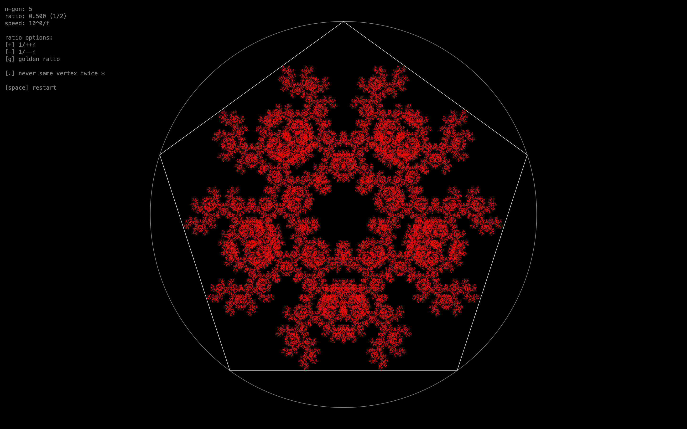
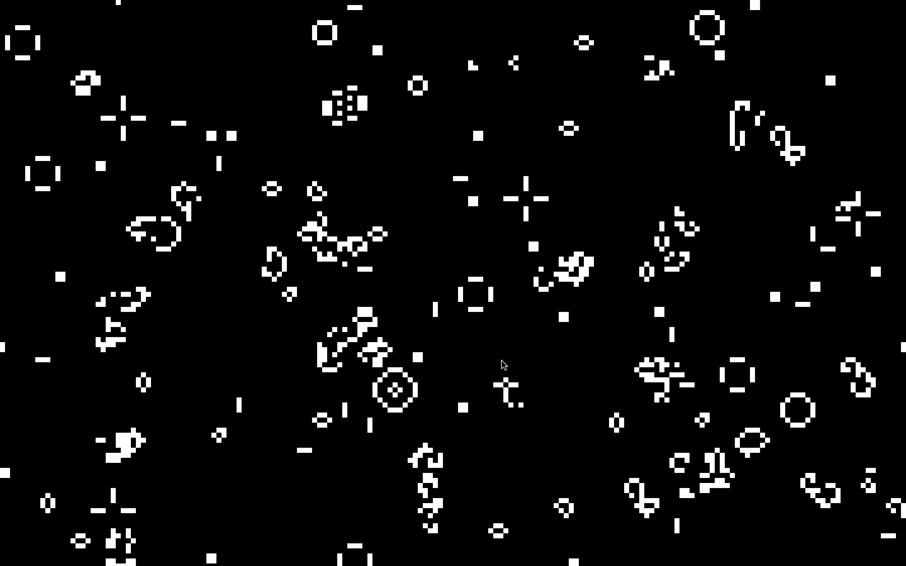
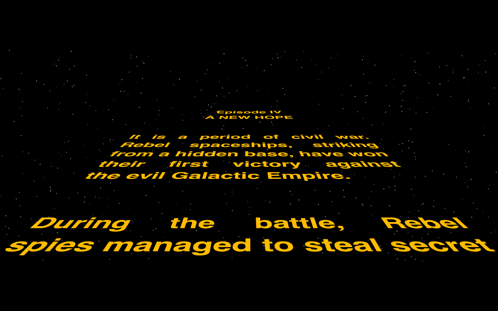
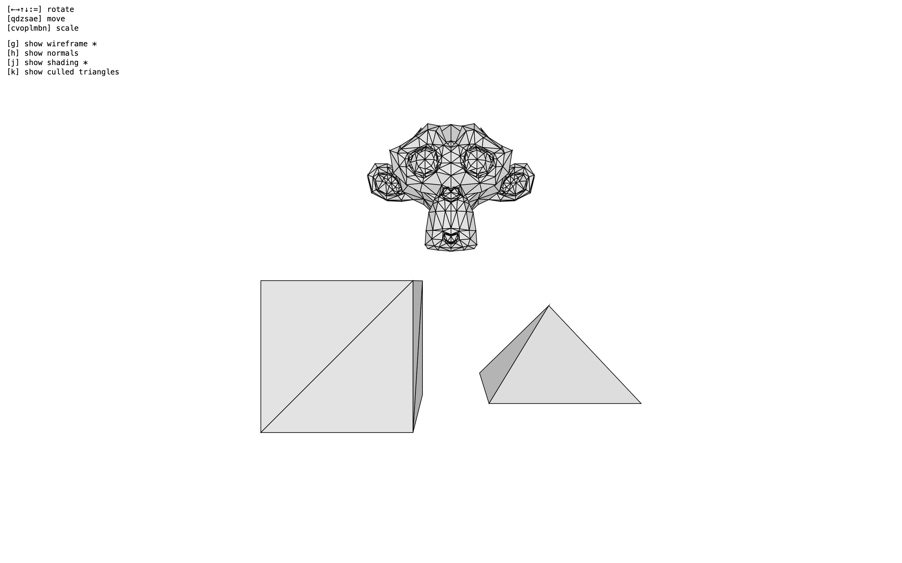
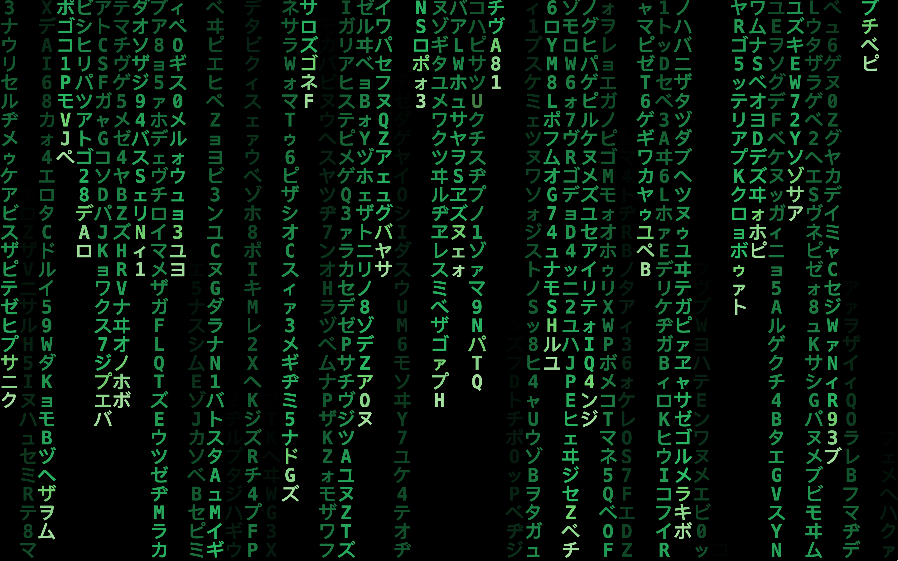
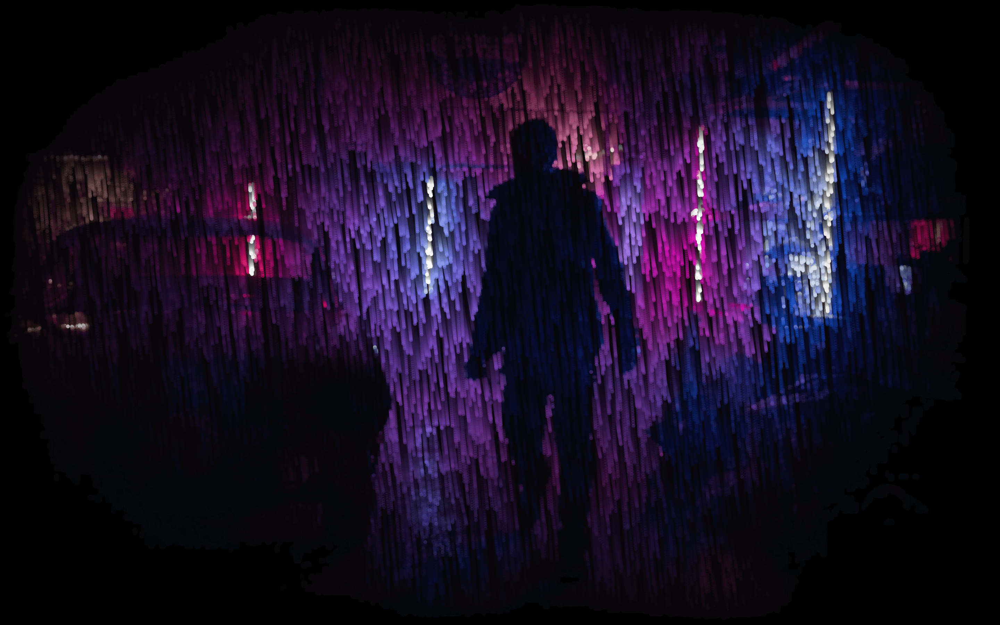

# Painter

Painter is a bare-bones drawing toolkit for HTML5 canvas. It takes away
a lot of boilerplate code, like setting up the canvas, creating the game
loop, listening for events, etc.

## Demo

<p align="center">
  
  
  
  
  
  
</p>

## Overview

Open `index.html` in your browser and `main.js` in a code editor. That's
it for the setup.

There are two base functions you can edit: `setup()` and `render()`.

- `setup()` is called once at load time, right before the game loop
  starts. This is where the Painter instance is initialized (more or
  less like a class constructor).
- `render(delta_time)` is called once per iteration of the game loop.
  This is where the individual frames are drawn. `delta_time` is the
  amount of time elapsed since last `render()`, in fractional seconds
  (used to decouple animation speed from frame rate).

In addition, there are many (optional) helper methods and properties you
can use. Read through `painter.js` and look at the [`demo/`](./demo)
directory to get a feel for what is available.

## Quick Start

Open `main.js` and edit the demo code to draw a 70×70px red square at
the center top of the canvas (think "screen", as by default the canvas
takes up the whole screen).

```javascript
class App extends Painter {
  render() {
    this.ctx.clear();
    this.ctx.fillStyle = "red";
    this.ctx.fillRect(this.rect.cx - 35, this.rect.y, 70, 70);
  }
}
```

A few things to note:

- `this.rect` is an instance of `Rect`, a class that holds frequently
  used properties of the canvas, like X, Y, width, height, etc. (see
  `painter.js`).
- `cx` and `y` are properties of `Rect`, and represent the center on the
  X axis (`x + (width / 2)`) and the top of the canvas respectively.
- `this.ctx.clear()` is a convenience method that clears the entire
  canvas. Equivalent to the longer `this.ctx.clearRect(x, y, w, h)`.
- These are all just helpers, you could very well do the same manually.
  And this is true for all the other helpers.

Let's refactor the code a bit and add velocity to the square.

```javascript
class App extends Painter {
  setup() {
    this.square = {
      x: this.rect.cx - 35,
      y: this.rect.y,
      w: 70,
      h: 70,
      vy: 400, // Add velocity property.
    };
  }

  render(delta_time) {
    this.ctx.clear();
    this.ctx.fillStyle = "red";

    // Move square down (apply velocity).
    this.square.y += this.square.vy * delta_time;

    // Reset position when it falls out.
    if (this.square.y > this.rect.yh) {
      this.square.y = this.rect.y - this.square.h;
    }

    // Draw square.
    const { x, y, w, h } = this.square;
    this.ctx.fillRect(x, y, w, h);
  }
}
```

A few things to note:

- The square's properties are now part of the state. This way, they are
  easier to update and keep track of.
- `vy` means velocity in the Y direction. This is how much the square
  moves in pixels per second (modulated by `delta_time`).
- On each iteration, the square's velocity is added to its current Y
  position, making it fall (`this.square.y += this.square.vy`).
- Velocity is modulated by `delta_time` (`this.square.vy * delta_time`),
  otherwise it would fall faster with faster frame rates and slower with
  slower frame rates. If for instance `delta_time = 0.017`, it means
  time has advanced by 0.017 seconds, so we want the square to move
  `400px/s * 0.017s = 6.8px`.
- Finally, the square is teleported back to the top of the canvas if it
  falls out on the bottom. This condition uses `yh`, another helper
  property of `Rect`, shorthand for `y + h` (= bottom).

Now try and tweak it a little to use gravity (acceleration) instead of a
constant speed. Also, try and find a way to pause the simulation by
hitting the space key (hint: you can overload `key_press_event(key)`).

_(Solution included in next step)._

Lastly, we'll add some rudimentary collision detection with the mouse.
If the mouse pointer is in the square, we want to color it green instead
of red.

```javascript
class App extends Painter {
  setup() {
    this.gravity = 750; // Gravity constant, determined empirically.
    this.square = {
      x: this.rect.cx - 35,
      y: this.rect.y,
      w: 70,
      h: 70,
      vy: 0, // This time, velocity starts at 0.
    };
    this.is_paused = false;
  }

  key_press_event(key) {
    // Toggle is_paused every time the space key is pressed down.
    if (key === " ") this.is_paused = !this.is_paused;
  }

  render(delta_time) {
    // If paused, simply don't clear/update/render.
    if (this.is_paused) return;

    this.ctx.clear();

    // Increase velocity by gravity constant.
    this.square.vy += this.gravity * delta_time;
    // Apply velocity.
    this.square.y += this.square.vy * delta_time;

    if (this.square.y > this.rect.yh) {
      this.square.y = this.rect.y - this.square.h;
      // Now we also need to reset the velocity, otherwise
      // it would accelerate forever.
      this.square.vy = 0;
    }

    const { x, y, w, h } = this.square;

    // Move collision detection after state updates.
    this.ctx.fillStyle = "red";
    // Check collision with mouse pointer.
    if (
      this.mouse.x >= x &&
      this.mouse.x <= x + w &&
      this.mouse.y >= y &&
      this.mouse.y <= y + h
    ) {
      this.ctx.fillStyle = "green";
    }

    this.ctx.fillRect(x, y, w, h);
  }
}
```

A few things to note:

- `key_press_event(key)` is one of many helper event handlers. Look at
  `painter.js` for more (resize, mouse, keyboard, wheel, etc.)
- `this.mouse` works similarly to `this.rect`, but contains info about
  the current state of the mouse. There is also `this.keyboard` for the
  keyboard.

### Going further

This would clearly be overkill here, but larger projects don't usually
use a single space like we're doing. They use what's called a "world
space" and a "screen space".

This decouples the "engine" part from the "rendering" part. All the
physics are computed in world space. That is, unit space, with
boundaries of 0 and 1, or -1 and 1 usually (think unit circle). During
the rendering, the values in unit space are mapped to real-world screen
pixels.

You could try to apply this concept to the example above, using a
`world_to_screen(x, y)` function to convert world coordinates to screen
coordinates, and a `screen_to_world(x, y)` function to convert
real-world mouse event coordinates to world coordinates. Don't forget to
take the canvas' aspect ratio (`this.rect.ar`) into account if you plan
to move the square in 2D. There's a simple example in
[demo/screen_saver.js](./demo/screen_saver.js).
