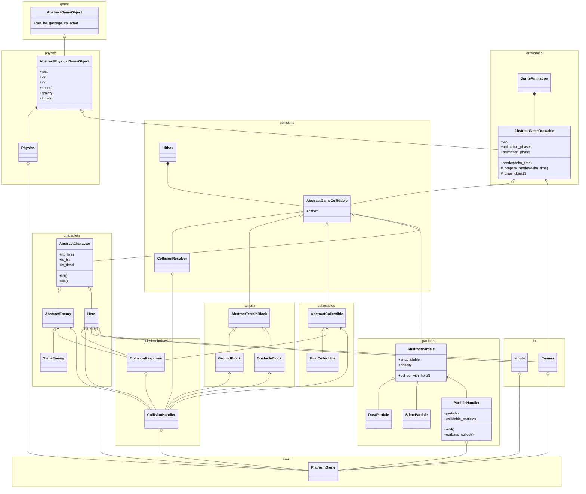

```mermaid
classDiagram
  namespace game {
    class AbstractGameObject {
      +can_be_garbage_collected
    }
  }

  namespace physics {
      class AbstractPhysicalGameObject {
        +rect
        +vx
        +vy
        +speed
        +gravity
        +friction
      }
    class Physics
  }

  AbstractGameObject <|-- AbstractPhysicalGameObject
  AbstractPhysicalGameObject <-- Physics

  namespace drawables {
    class SpriteAnimation
    class AbstractGameDrawable {
      +ctx
      +animation_phases
      +animation_phase
      +render(delta_time)
      #_prepare_render(delta_time)
      #_draw_object()
    }
  }

  SpriteAnimation *-- AbstractGameDrawable
  AbstractPhysicalGameObject <|-- AbstractGameDrawable

  namespace collisions {
    class Hitbox
    class AbstractGameCollidable {
      +hitbox
    }
    class CollisionResolver
  }

  Hitbox *-- AbstractGameCollidable
  AbstractGameDrawable <|-- AbstractGameCollidable
  AbstractGameCollidable <|-- CollisionResolver

  namespace terrain {
    class AbstractTerrainBlock
    class GroundBlock
    class ObstacleBlock
  }

  AbstractGameCollidable <|-- AbstractTerrainBlock
  AbstractTerrainBlock <|-- GroundBlock
  AbstractTerrainBlock <|-- ObstacleBlock

  namespace collectibles {
    class AbstractCollectible
    class FruitCollectible
  }

  AbstractGameCollidable <|-- AbstractCollectible
  AbstractCollectible <|-- FruitCollectible

  namespace particles {
    class AbstractParticle {
      +is_collidable
      +opacity
      +collide_with_hero()
    }
    class DustParticle
    class SlimeParticle
    class ParticleHandler {
      +particles
      +collidable_particles
      +add()
      +garbage_collect()
    }
  }

  AbstractGameCollidable <|-- AbstractParticle
  AbstractParticle <|-- DustParticle
  AbstractParticle <|-- SlimeParticle
  AbstractParticle <-- ParticleHandler

  namespace characters {
    class AbstractCharacter {
      +nb_lives
      +is_hit
      +is_dead
      +hit()
      +kill()
    }
    class AbstractEnemy
    class SlimeEnemy
    class Hero
  }

  AbstractGameCollidable <|-- AbstractCharacter
  AbstractCharacter <|-- AbstractEnemy
  AbstractEnemy <|-- SlimeEnemy
  AbstractCharacter <|-- Hero

  namespace collision-behaviour {
    class CollisionResponse
    class CollisionHandler
  }

  AbstractCollectible <-- CollisionResponse
  AbstractEnemy <-- CollisionResponse
  Hero <-- CollisionResponse
  CollisionResolver o-- CollisionHandler
  CollisionResponse o-- CollisionHandler
  GroundBlock <-- CollisionHandler
  ObstacleBlock <-- CollisionHandler
  AbstractCollectible <-- CollisionHandler
  AbstractEnemy <-- CollisionHandler
  Hero <-- CollisionHandler

  namespace io {
    class Inputs
    class Camera
  }

  Hero <-- Inputs
  AbstractGameDrawable <-- Camera
  Hero <-- Camera

  namespace main {
    class PlatformGame
  }

  Hero o-- PlatformGame
  ParticleHandler o-- PlatformGame
  CollisionHandler o-- PlatformGame
  Inputs o-- PlatformGame
  Camera o-- PlatformGame
  Physics o-- PlatformGame
```
